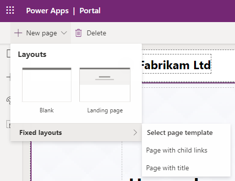
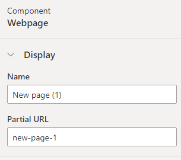
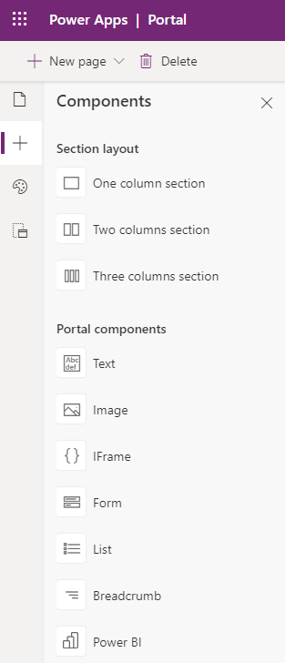
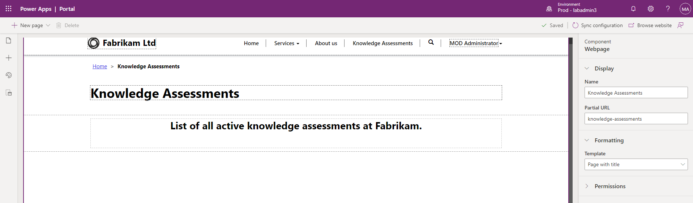
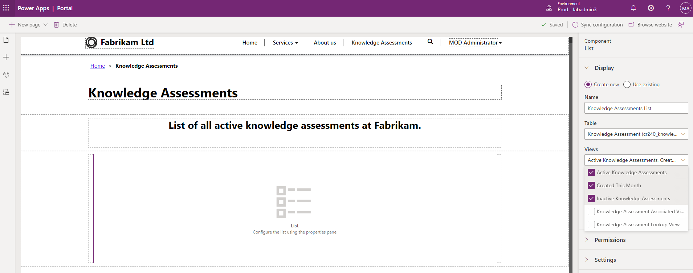
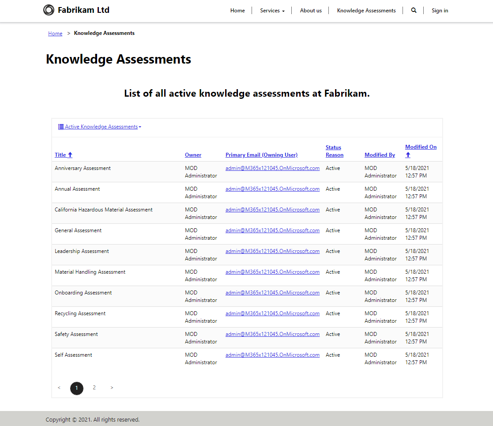

# Microsoft Power Platform Functional Consultant (PL-200)

## Microsoft Power Apps Portals Hands-On Lab

### Overview

--------------

In this exercise you will update the blank Power Apps portal with dynamics content coming from the Dataverse database.

### Prerequisites

--------------

In order to create the portal solution, following prerequisites must exist:

- The Power App Portals instance **Fabrikam** must be fully provisioned in the training environment
- The **Knowledge Assessment** solution must be completely developed
- The **import of data** into the Knowledge Assessment table must be performed (optionally create some records manually)

### Exercise 1: Create a portal webpage

--------------

#### Task 1: Navigate to the portal

1. Navigate to the Maker Portal: <https://make.powerapps.com>.
2. Verify the environment selector and make sure, you are in the correct training environment.
3. Click on **Apps**.
4. Locate the portal app **Fabrikam** (App type is **Portal**).
5. Click on the app name (Fabrikam) to open the portal.
6. Check the structure of the blank Power Apps portal.

#### Task 2: Create a webpage

1. Return to the Maker Portal.
2. Locate the portal app.
3. Click on the ellipses (...) to the right of the portals app name and choose **Edit**.
4. This will open the portal in the **Portal Studio**.
5. On the command bar, click **New page** and select the **Fixed layout** with the name **Page with title**.

    

6. The new webpage will be created, this can take few seconds.
7. In the properties pane on the right side of the Portals Studio, change the **Name** of the new webpage to ```Knowledge Assessments```.
8. In the same properties pane change the ***Partial URL*** to ```knowledge-assessments```.

    

9. Press the **Tab** key to move away from the field to trigger an auto-save process.
10. As a result, the new webpage with the proper name is ready to be modified and the page is also part of the main portal navigation.

#### Task 3: Add static content

1. On the canvas (area showing webpage), select the **Page Copy** section. This is the large box around the 2 sentences of text in the middle of your page.
2. On the toolbelt (left side), select the **Components** icon.
3. Choose **One column section** from the **Section layout** area.

    
 
4. Select the column of the newly added section.
5. On the toolbelt (left side), select the **Components** icon.
6. Choose **Text** from the **Portal components** area.
7. Click into the text and add the following input: ```List of all active knowledge assessments at Fabrikam.```.
8. Format the text according to individual preferences.
9. Select the text box above the one you just edited, and click **Delete** on the command bar to remove the default text.
10. Verify the result according to the following image:

    
 
#### Task 4: Add a list component

1. Select the previously created section.
2. On the toolbelt (left side), select the **Components** icon.
3. Choose **One column section** from the **Section layout** area.
4. Select the column of the newly added section.
5. On the toolbelt (left side), select the **Components** icon.
6. Choose **List** from the **Portal Components** area (a list component will appear in the new section).
7. Select the list component on the canvas.
8. In the properties pane (right side), enter ```Knowledge Assessments List``` in the **Name** field.
9. In the **Table** field, choose **Knowledge Assessment (cxxxx_knowledgeassessment)** from the drop-down list
10. In the **Views** select any number of existing table views.

    
 
11. Click **Browse website** to view the portal page in a separate browser tab.

    
 
## End of the Power Apps Portals Hands-On Lab
