# Microsoft Power Platform Functional Consultant (PL-200)

## Microsoft Power BI Hands-On Lab

### Overview

------------

In this exercise you will create a Power BI analytics for the Knowledge Assessment solution. The Power BI dashboard will be embedded into the Knowledge Admin model-driven app.

### Prerequisites

------------

In order to create a Power BI solution, following prerequisites must exist:

- The Knowledge Assessment solution must be completely developed
- Power BI Desktop tool must be installed on the local PC

### Exercise 1: Setup environment

------------

#### Task 1: Install Power BI Desktop / Prepare Power BI service

1. Navigate to <https://aka.ms/pbidesktopstore> to download and install Power BI Desktop.
2. Navigate to <https://app.powerbi.com/> and click **Sign in**.
3. Scroll down the main section of the web page and click **My Workspace** towards the bottom of the screen. Or expand Workspaces in the navigation and select **Create a workspace**.
4. Enter a name for the workspace similar to your environment name **[my initials] Practice**. (Example: AJ Practice.) and click **Save**.

### Exercise 2: Create a data model and visualisations

------------

#### Task 1: Connect to the Power Platform

1. Start the Power BI Desktop
2. Sign-in with your cloud credentials and wait until you name will show up in the upper right corner of Power BI Desktop
3. Select Get **Data > More > Power Platform > Common Data Service (Legacy)**
4. Click **Connect**

    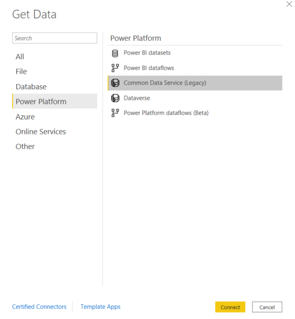

5. Enter the **URL** of your Power Platform environment

    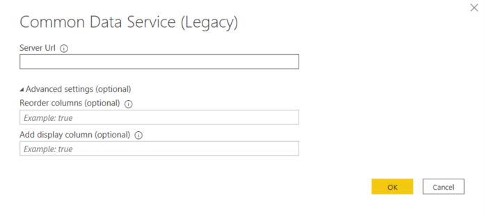

6. Click **OK**
7. Click **Sign in** and sign in once again with your cloud credentials
8. Click **Connect**
9. In the data selection dialog, select following tables, you have created in your Knowledge Assessment Solution:
    - Knowledge Assessment
    - Knowledge Question
    - Knowledge Test Result
    - SystemUser
10. Click **Load**

    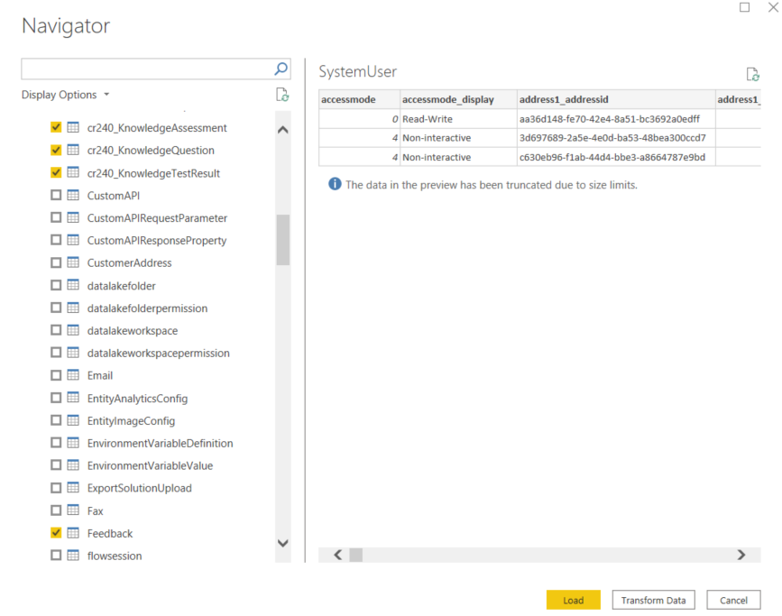

11. Wait until the data is loaded to Power BI

#### Task 2: Create Data Model

1. In the Power BI Desktop switch to the **Model** view
2. Establish the relationships between the tables as follows:
    - **1:N** relationship between the **Knowledge Assessment** and the **Knowledge Question**
    - **1:N** relationship between the **Knowledge Assessment** and the **Knowledge Test Result**
    - **1:N** relationship between the **User** and the **Knowledge Test Result** (use the field **Owner** for the relationship)
according to the following screenshot:

    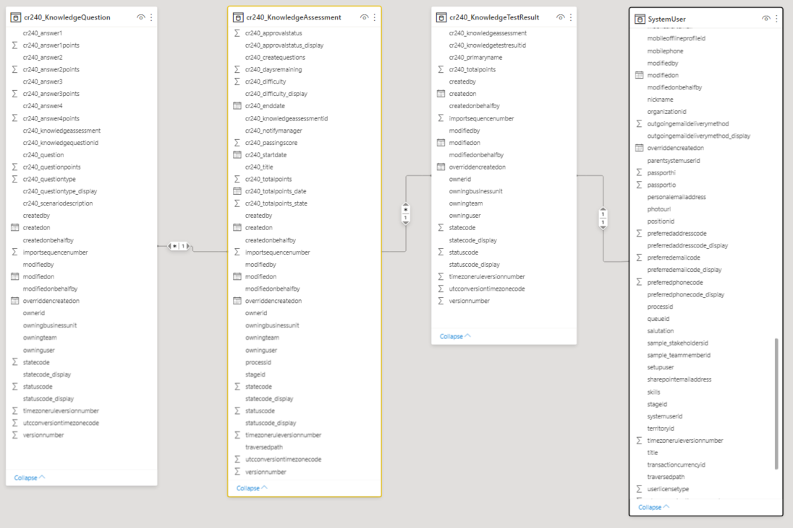

#### Task 3: Create Test Result Chart

1. In the Power BI Desktop switch to the **Report** view
2. In the **Fields** pane on the right side locate the field "xxxxx_totalpoints" ("xxxxx" represents you individual field prefix) in the table "xxxxx_KnowledgeTestResult" and rename the field to "Total Points" according to the following screenshot:

    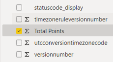

3. In the field list locate the field "fullname" in the table "SystemUser" and rename the field to "Name" according to the following screenshot:

    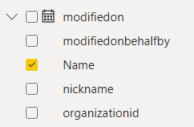

4. Drag and drop the **Stacked column chart** from the **Visualisations** pane to the working canvas
5. Locate the previously renamed fields "Name" and "Total Points" and drag and drop them to the "Axis" and "Values" parameters of the chart according to the following screenshot:

    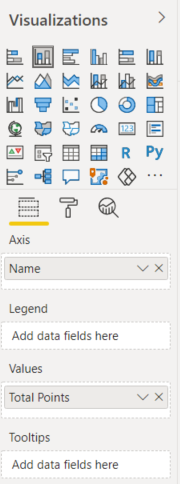

6. The result will look like the following example screenshot. The composition of the chart depends on the values in the table **Knowledge Test Result**.

    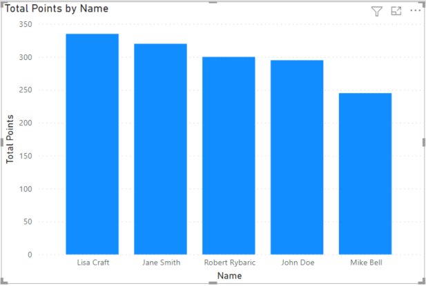

7. While having the visualisation selected, change the visualisation type to **Pie chart**. The result will look like the following example screenshot:

    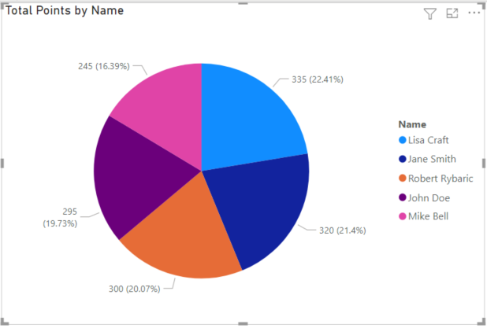

#### Task 4: Create Questions Chart

1. In the **Fields** pane locate the field "xxxxx_question" in the table "xxxxx_KnowledgeQuestion" and rename the field to "Question". Locate the field "xxxxx_questionpoints" in the table "xxxxx_KnowledgeQuestion" and rename the field to "Question Points" according to the following screenshot:

    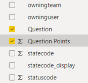

2. Locate the **Stacked bar chart** on the **Visualisations** pane and drag it below the first chart.
3. Locate the previously renamed fields "Question" and "Question Points" and drag and drop them to the "Axis" and "Values" parameters of the chart according to the following screenshot:

    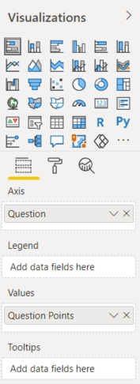

4. The result will look like the following example screenshot. The composition of the chart depends on the values in the table **Knowledge Question**.

    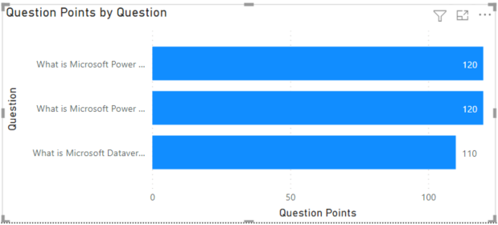

### Exercise 3: Deploy the Power BI report

------------

#### Task 1: Save the report

1. In Power BI Desktop navigate to **File > Save As**
2. Give the report the name **Knowledge Analytics** and save the file on you local comupter.

#### Task 2: Publish the report

1. Verify, that you are signed-in with your correct cloud credentials
2. Click the **Publish** button on the ribbon
3. Wait until the publishing settings show up.
4. Select the workspace created at the beginning of this lab and click **Select**
5. Wait until the report is fully published according to the following screenshot:

    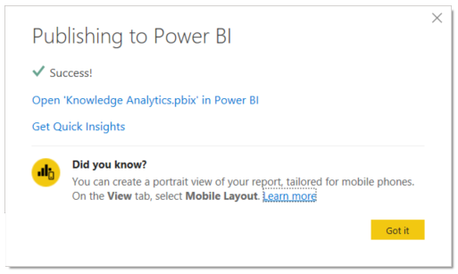

6. Click on **Open 'Knowledge Analytics' in Power BI**
7. In the Power BI service, there will be 2 components, according to the following screenshot:

    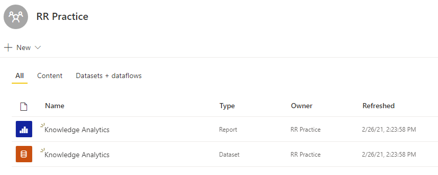

8. Close the Power BI Desktop.

### Exercise 4: Create a Power BI dashboard

------------

#### Task 1: Create the dashboard

1. In the Power BI service open the workspace and navigate to the **Knowledge Analytics** report
2. Hover with the mouse over the first visualization and select the **Pin visual** button in the upper part of the visualization, according to the following screenshot:

    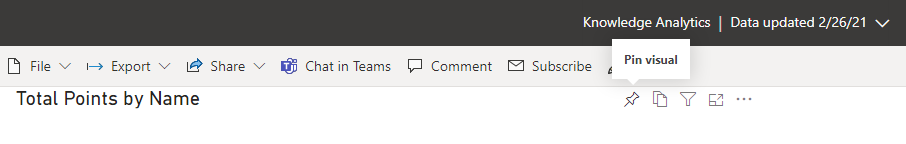

3. In the **Pin to dasboard** dialogue, select the option **New Dashboard** and give the dashboard a name "Knowledge Analytics", according to the following screenshot:

    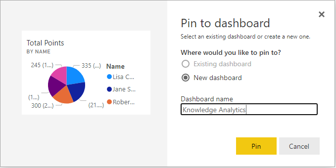

4. Repeat the same procedure with the second visualization, however in the **Pin to dasboard** dialog, select the just created **Existing dashboard** -> **Knowledge Analytics**.
5. Navigate to the newly created **Knowledge Analytics** dashboard. The result should be similar to the following screenshot:

    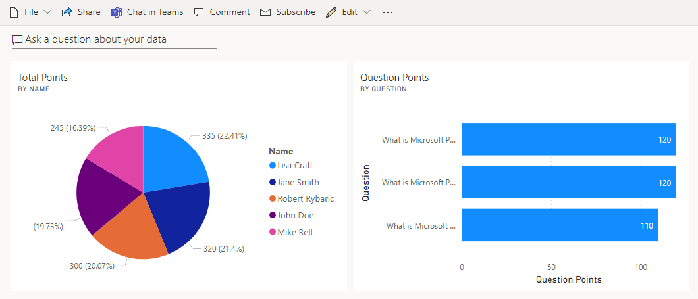

6. Click on **Edit > Mobile view**. This view gives you the possibility to format the dashboard for convinient use on mobile devices according to the following screenshot:

    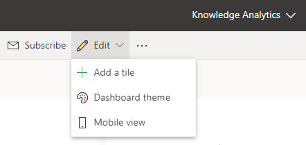

7. Change the formatting appropriately, according to the following screenshot:

    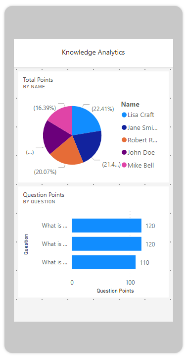

8. Close the Power BI service.

### Exercise 5: Add the Power BI dashboard to the model-driven app

------------

#### Task 1: Enable Power BI embedding

1. Navigate to the Power Platform Admin Center <https://admin.powerplatform.microsoft.com/>
2. Select your environment and go to **Settings**
3. Select the **Features** setting
4. In the settings area **Embedded content**, enable the **Power BI visualization embedding**, according to the following screenshot:

    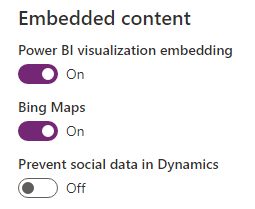

#### Task 2: Add the dashboard

1. Navigate to your model-driven app **Knowledge Admin**
2. Navigate to **Dashboards**
3. Click on **New > Power BI Dashboard**, according to the following screenshot:

    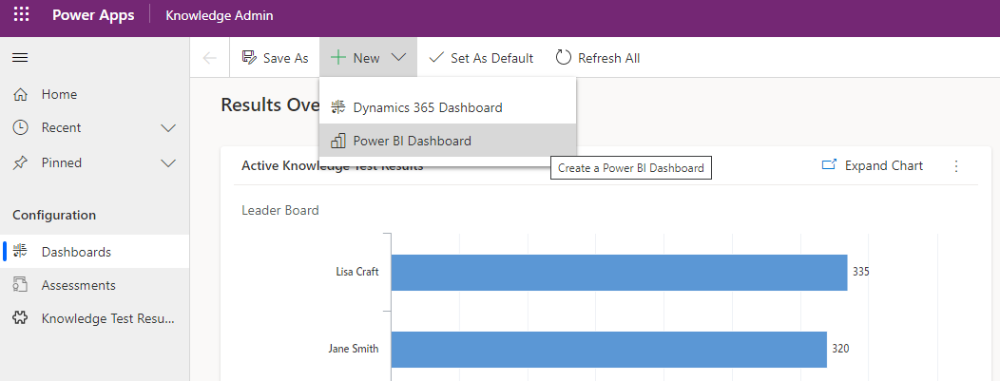

4. Select the proper Power BI workspace and the dashboard **Knowledge Analytics** and click **Save**, according to the following screenshot:

    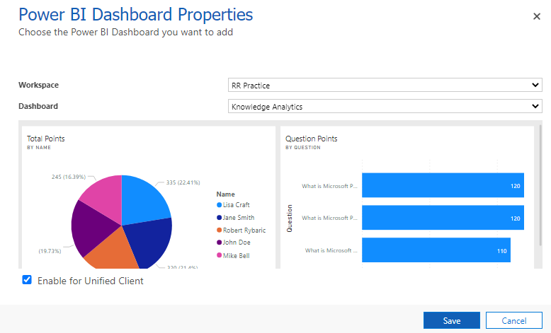

5. The Power BI dashboard is now embedded in the model-driven app in the group **My dashboard**, according to the following screenshot:

    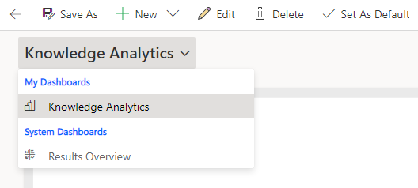

## End of the Power BI Hands-On Lab
